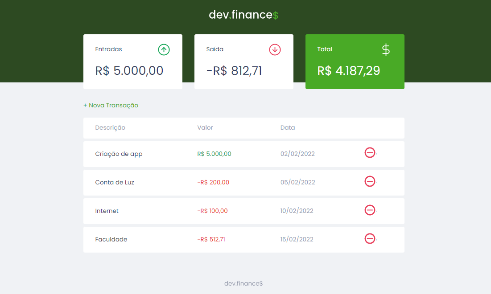
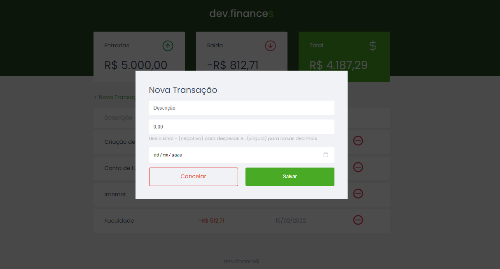
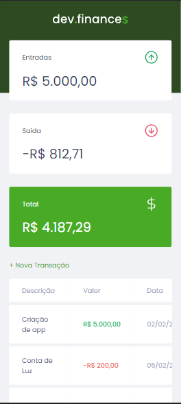

<h1 align="center">
  
</h1>
<p align="center">🤑 a platform for recording financial transactions 🤑</p>

<br>

<div align="center">
  
  
  
  
  
  
  
  
  <h4 align="center"> 
    🚧 . . . 🚀 Under construction . . .  🚧
  </h4>

  <nav>
    <a href="#about">About</a> •
    <a href="#functions">Functions</a> • 
    <a href="#techs">Technologies</a> • 
    <a href="#use">How to use</a> • 
    <a href="#dev">Dev</a>
  </nav>

</div>

<br>
  
<div align="center">
  <p></p>
  <p></p>
  <p></p>
</div>

<h2 id="about">👀 About 💬</h2>
<br>
<p>
  dev.finance$ is a platform for controlling expenses where you can monitor a person's inflows and outflows (expenses or income) and show the final balance, comparing the sum total of the 2 follow-ups to generate a profit real on top of all posted expenses.
</p>

<br><br>

<h2 id="functions">🧾 Functions </h2>
<br>
  <div align="center">
    <p>📥 Lançamento de despesa e receita</p>
    <p>📇 Exclusão de despesa e receita</p>
    <p>📑 Listagem de contas</p>
    <p>📊 Resultado total de valores</p>
    <p>🗄 Armazenamento de dados no localStorage</p>
  </div>  

<br><br>

<h2 id="techs">🖥 Technologies used</h2>
<br>
  <p align="center">The base project was built with the technologies</p>
  
  <div align="center">
    
    
    
  </div>

<br><br>

<h2 id="use">📚 Download and run the project:</h2>

<br><br>

<h3>Via github</h3>

```bash
  # Download the project ZIP
  $ Click Code and Download ZIP

  # Choose a save location
  
  # Open with your preferred editor

  # If using Vs Code you can use the Live server extension to run the project
  # Right click (inside vscode) on index.html and set to "Open with Live Server"

  # 😀 Be happy 😀!!!
 ```

<br><br>

<h3>Using git bash</h3>

```bash
  # Make a clone of the repository
  $ git clone https://github.com/Fledson/dev.finance.git

  # Open the file or directory (via VScode):
  $ code .

  # Can use Live server extension to run the project
  
  # Right click (inside vscode) on index.html and set to "Open with Live Server"

  # 😀 Be happy 😀!!!
 ```
---
<p id="dev" align="center">
  Developed by Fledson Henrique 🥷
</p>
